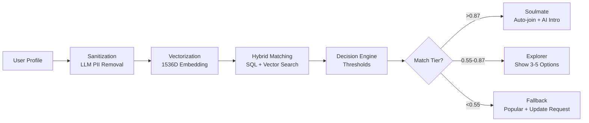

# AI-Powered Community Matching System v2.0

Intelligent onboarding solution with **<2 second** community matching using hybrid algorithms.

## 🏗️ Architecture

### Tech Stack
- **API**: Python FastAPI (async, Pydantic validation)
- **Task Queue**: Celery + Redis broker
- **Database**: PostgreSQL 16 (user data) + Pinecone (vectors)
- **AI/ML**: OpenAI GPT-4o-mini + text-embedding-3-small
- **Real-time**: WebSocket (Socket.io) + Redis Pub/Sub

### Matching Pipeline (5 Phases)



## 🚀 Quick Start

### 1. Installation

```bash
# Clone repository
git clone <repo_url>
cd matching_system

# Install dependencies
pip install -r requirements.txt

# Configure environment
cp .env.example .env
# Edit .env with your API keys
```

### 2. Database Setup

```sql
-- PostgreSQL schema
CREATE TABLE communities (
    community_id TEXT PRIMARY KEY,
    community_name TEXT NOT NULL,
    category TEXT NOT NULL,
    city TEXT NOT NULL,
    timezone TEXT NOT NULL,
    member_count INTEGER DEFAULT 0,
    description TEXT,
    is_active BOOLEAN DEFAULT true,
    created_at TIMESTAMP DEFAULT NOW()
);

CREATE TABLE community_members (
    user_id TEXT NOT NULL,
    community_id TEXT NOT NULL,
    joined_at TIMESTAMP DEFAULT NOW(),
    auto_joined BOOLEAN DEFAULT false,
    PRIMARY KEY (user_id, community_id)
);

CREATE TABLE community_activity (
    message_id TEXT PRIMARY KEY,
    community_id TEXT NOT NULL,
    user_id TEXT NOT NULL,
    created_at TIMESTAMP DEFAULT NOW()
);

CREATE TABLE users (
    user_id TEXT PRIMARY KEY,
    username TEXT NOT NULL,
    bio TEXT,
    created_at TIMESTAMP DEFAULT NOW()
);

-- Indexes for performance
CREATE INDEX idx_communities_location ON communities(city, timezone);
CREATE INDEX idx_activity_recent ON community_activity(community_id, created_at);
```

### 3. Start Services

```bash
# Terminal 1: Start FastAPI
uvicorn matching_system.api:app --reload --port 8000

# Terminal 2: Start Celery Worker
celery -A matching_system.celery_tasks worker --loglevel=info --concurrency=4

# Terminal 3: Start Redis (if not running)
redis-server
```

### 4. Test API

```bash
# POST request to initiate matching
curl -X POST http://localhost:8000/api/v1/match \
  -H "Content-Type: application/json" \
  -d '{
    "user_id": "user_123",
    "bio": "Software engineer passionate about AI and machine learning. I code daily in Python.",
    "interest_tags": ["Programming", "AI", "Tech"],
    "city": "San Francisco",
    "timezone": "America/Los_Angeles"
  }'

# Response (immediate <50ms)
{
  "task_id": "abc-123-def",
  "status": "processing",
  "estimated_time_ms": 2000,
  "websocket_channel": "match_updates_user_123"
}

# Poll for results
curl http://localhost:8000/api/v1/match/abc-123-def
```

## 🧠 Hybrid Matching Algorithm

### Phase A: Location Filter (SQL)
```python
# Reduces search space by ~95%
WHERE city = $1 AND timezone = $2
```

### Phase B: Vector Search (Pinecone)
```python
# Cosine similarity on filtered subset
query(vector=user_embedding, top_k=20, filter={"community_id": {"$in": filtered_ids}})
```

### Phase C: Diversity Injection
```python
# If top 3 matches are same category, inject 1 diverse match at position 2
if all_same_category(top_3):
    inject_diverse_match()
```

## 📊 Decision Engine Thresholds

| Tier | Threshold | Action |
|------|-----------|--------|
| **Soulmate** | >0.87 | Auto-join community + AI-generated intro with @mention |
| **Explorer** | 0.55-0.87 | Show 3-5 match options with scores |
| **Fallback** | <0.55 | Show popular communities + request profile update |

## 🎯 AI Introduction Generator

Triggered on **Soulmate** matches:

1. Fetch user bio + community description
2. Retrieve top 5 active members (7-day activity)
3. Generate friendly intro (max 3 sentences) with GPT-4o-mini
4. Run toxicity check (block if score >0.75)
5. Post to community channel with @mention

## 💾 Caching Strategy

| Layer | Data | TTL | Storage |
|-------|------|-----|---------|
| L1 (Browser) | Static assets | 24h | LocalStorage |
| L3 (Redis) | User vectors | 7 days | Redis pickle |
| L3 (Redis) | Group vectors | 24h | Redis pickle |
| L4 (PostgreSQL) | Query results | 15min | Redis JSON |

## 📈 Performance Targets

- ✅ Task ID response: **<50ms**
- ✅ Total matching: **<2000ms**
- ✅ Vector embedding: **~300ms**
- ✅ Pinecone search: **~100ms**
- ✅ SQL filter: **~50ms**

## 🔧 Configuration

Edit `.env` file:

```bash
# Required
OPENAI_API_KEY=sk-...
PINECONE_API_KEY=...
POSTGRES_PASSWORD=...

# Optional (defaults provided)
REDIS_HOST=localhost
API_PORT=8000
```

## 📝 Code Structure

```
matching_system/
├── api.py              # FastAPI endpoints
├── celery_tasks.py     # process_match_task (main logic)
├── models.py           # Pydantic schemas
├── database.py         # PostgreSQL + Pinecone
├── ai_services.py      # OpenAI integration
├── cache.py            # Redis caching
├── requirements.txt    # Dependencies
└── .env.example        # Config template
```

## 🐛 Troubleshooting

### Task timeout
- Increase `task_time_limit` in `celery_tasks.py`
- Check Pinecone index performance

### Low match scores
- Review embedding quality
- Check if location filtering is too restrictive
- Verify user profile has sufficient content

### AI intro blocked
- Review toxicity threshold (currently 0.75)
- Check OpenAI moderation API response

## 📄 License

MIT License
